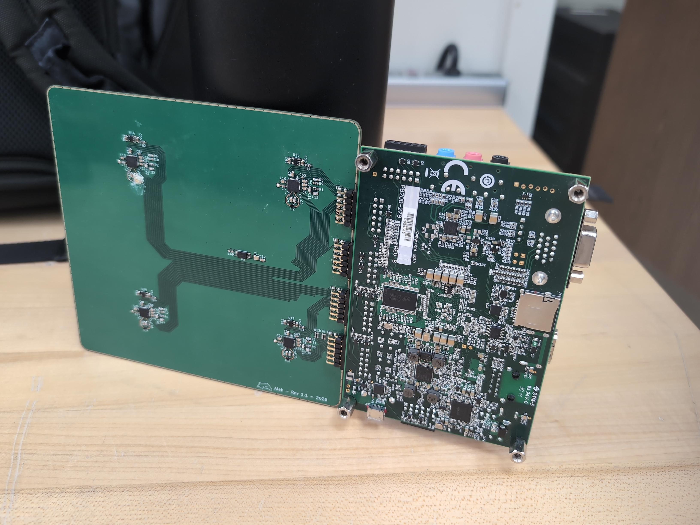
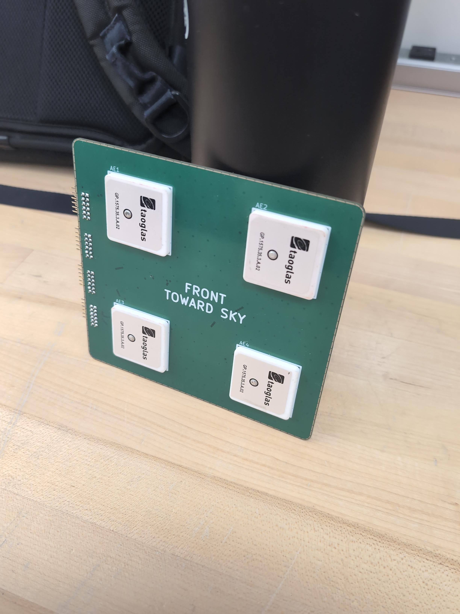

# GNSS Anti-Jammer & Signal Processing

## Project Owner

**Name:** Alek  
**Virginia Tech Email:** aleks@vt.edu

## Project Overview

Satellite navigation signal processing software developed in SystemVerilog and tested using simulated GPS signals with HackRF SDR. The system implements GPS signal acquisition, fast Fourier transforms, tracking loops, and continuous IQ sample generation to track GNSS signals and test bit detection.

## What I Hope to Learn

- Advanced GNSS signal processing and tracking loop integration.
- High-bandwidth system implementation and digital design.
- Software-defined radio (SDR) interfacing and logic implementation.

## Design and Implementation

- **Software Architecture:** MATLAB-based GNSS tracking code.
- **Hardware Integration:** HackRF, Zynq FPGA, Custom PCB utilized for continuous IQ sample generation and RF front-end processing.
- **Core Algorithms:** Implements GPS signal acquisition via fast Fourier transforms (FFTs), followed by tracking loops, bit detection, and pseudorange estimation.

## Bill of Materials

All already bought

**Estimated Total Cost:** ~$0

## Timeline and Milestones

| Milestone | Target Date | Status |
|---|---|---|
| Signal acquisition implementation | June 2026 | Completed |
| Tracking loop integration | July 2026 | Completed |
| Bit detection testing | August 2026 | In Progress |
| Anti-jamming logic integration | TBD | Not Started |

## Progress Log

### 2026-07-31

Completed basic signal acquisition and tracking software implementations. Successfully tested bit detection and integrated tracking loops.

## Project Files
Not uploaded due to grey zone laws about anti jammers
## Useful Links

## Project Image

